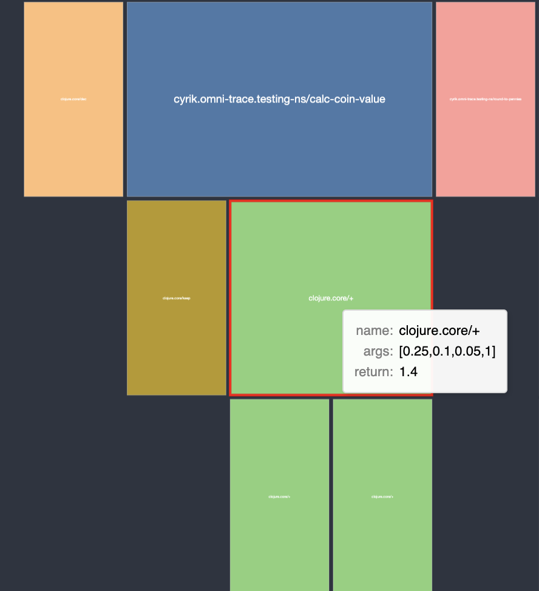

# omni-trace
Omnipotent/omniscient tracing core for debugging clojure(script)

very early alpha, api is still unstable but its only for dev time so there shouldn't be any problems.
moved namespaces to cyrik.omni-trace and below. cyrik.omni-trace is the main entry point.


[](https://clojars.org/org.clojars.cyrik/omni-trace)

or just through github source: 

```clojure

:deps {omni_trace/omni_trace  {:git/url "https://github.com/Cyrik/omni-trace"
                               :sha     "5def7f9ad31d703317e5be5e64a57322e1c89eed"}}
                          
```

## Usage

[contrived example](https://github.com/bpiel/contrived-example) code for demo debugging pupose

```clojure
(ns user
  (:require [cyrik.omni-trace :as o]
            [cyrik.omni-trace.testing-ns :as e]
            [cyrik.omni-trace.instrument :as i]
            [cyrik.omni-trace.flamegraph :as flame]
            [portal.web :as p]))


(comment
  ;instrument a namespace
  (o/instrument-ns 'cyrik.omni-trace.testing-ns)
  ;run functions in that namespace
  (-> e/machine-init
      (e/insert-coin :quarter)
      (e/insert-coin :dime)
      (e/insert-coin :nickel)
      (e/insert-coin :penny)
      (e/press-button :a1)
      (e/retrieve-change-returned)) ;throws on purpose for demonstration
  ;look at traces for every function that was traced
  @i/workspace
  ;connect to portal
  (def portal (p/open))
  (add-tap #'p/submit)
  ;send the trace to portal as a vegajs flamegraph
  (tap> (o/flamegraph))
  ;remove tracing from a namesapce
  (o/uninstrument-ns 'cyrik.omni-trace.testing-ns))
```


## experimental deeptrace
```clojure
(require '[cyrik.omni-trace :as o])

;; uncomment to also trace clojure.core, tested with testing-ns only
;; (require '[cyrik.omni-trace.instrument :as i])
;; (reset! i/ns-blacklist [])
(o/run-traced 'cyrik.omni-trace.testing-ns/run-machine)

;; run this for cljs
;; (o/run-traced-cljs 'cyrik.omni-trace.testing-ns/run-machine)
(tap> (o/rooted-flamegraph 'cyrik.omni-trace.testing-ns/run-machine))
```

This uses [clj-kondo](https://github.com/clj-kondo/clj-kondo) to find all transitive calls from the provided symbol.
It then runs the function with any supplied args and untraces everything. This reaches all the way down into clojure.core.




If your deeptraced function only traced itself make sure it's namespace is required somewhere inside "src" or "dev".
I will add more options for choosing namespaces later.
Currently there are still a few problems with recursion, will have to rewrite the deps graph for it. 
I'm guessing a lot of code will stil explode when allowing clojure.core trace, since the tracing code itself uses those.
Will probably cleanup the blacklist and try to use local function copies for tracing.

## experimental inner-trace
get the WIP debux version:
```
:debux-src {:extra-deps {philoskim/debux
                                    {:git/url "https://github.com/Cyrik/debux.git"
                                     :sha "a957ee863f08551d4c0a0adad85c501976c36ef2"}}}
```
```clojure
(require '[cyrik.omni-trace :as o])
(require '[cyrik.omni-trace.instrument :as i])
(defn foo [a b & [c]]
  (if c
    (* a b c)
    (* a b 100)))
(o/instrument-fn 'user/foo {::o/workspace i/workspace :inner-trace true})
(foo 2 3)
(print @i/workspace)
;; =>
{:log
 {:67969
  {:args [2 3],
   :parent :root,
   :return 600,
   :name user/foo,
   :file "/Users/lukas/Workspace/clojure/omni-trace/dev/user.clj",
   :start 1638382816113,
   :inner
   [{:level 0, :form-id 1274972146, :form (defn foo [a b & [c]] (if c (* a b c) (* a b 100)))}
    {:form c, :coordinate [3 1], :result nil, :id 67970}
    {:form a, :coordinate [3 3 1], :result 2, :id 67971}
    {:form b, :coordinate [3 3 2], :result 3, :id 67972}
    {:form (* a b 100), :coordinate nil, :result 600, :id 67973}
    {:form (if c (* a b c) (* a b 100)), :coordinate nil, :result 600, :id 67974}
    {:binding result__20657__auto__, :coordinate nil, :result 600, :id 67975}],
   :id :67969,
   :end 1638382816116}},
 :max-callsites #{}}

;; works with loop recur
(defn fact [num]
  (loop [acc 1 n num]
    (if (zero? n)
      acc
      (recur (* acc n) (dec n)))))
(o/instrument-fn 'user/fact {::o/workspace i/workspace :inner-trace true})
(print @i/workspace)
;; =>
{:log
 {:68336
  {:args [3],
   :parent :root,
   :return 6,
   :name user/fact,
   :file "/Users/lukas/Workspace/clojure/omni-trace/dev/user.clj",
   :start 1638382991955,
   :inner
   [{:level 0,
     :form-id -364126590,
     :form (defn fact [num] (loop [acc 1 n num] (if (zero? n) acc (recur (* acc n) (dec n)))))}
    {:form num, :coordinate [3 1 3], :result 3, :id 68337}
    {:form n, :coordinate [3 2 1 1], :result 3, :id 68338}
    {:form (zero? n), :coordinate nil, :result false, :id 68339}
    {:form acc, :coordinate [3 2 3 1 1], :result 1, :id 68340}
    {:form (* acc n), :coordinate nil, :result 3, :id 68341}
    {:form (dec n), :coordinate nil, :result 2, :id 68342}
    {:form n, :coordinate [3 2 1 1], :result 2, :id 68343}
    {:form acc, :coordinate [3 2 3 1 1], :result 3, :id 68344}
    {:form (* acc n), :coordinate nil, :result 6, :id 68345}
    {:form (dec n), :coordinate nil, :result 1, :id 68346}
    {:form n, :coordinate [3 2 1 1], :result 1, :id 68347}
    {:form acc, :coordinate [3 2 3 1 1], :result 6, :id 68348}
    {:form (dec n), :coordinate nil, :result 0, :id 68349}
    {:form n, :coordinate [3 2 1 1], :result 0, :id 68350}
    {:form (zero? n), :coordinate nil, :result true, :id 68351}
    {:form (loop [acc 1 n num] (debux.common.util/insert-blank-line) (if (zero? n) acc (recur (* acc n) (dec n)))),
     :coordinate nil,
     :result 6,
     :id 68352}
    {:binding result__20657__auto__, :coordinate nil, :result 6, :id 68353}],
   :id :68336,
   :end 1638382991968}},
 :max-callsites #{}}
```
works pretty well already, but:

- works in clj only for now, working on cljs
- only one innertrace at a time or omni-trace will write the results to the wrong one
- debux still needs a lot of cleanup in the atom version
- api very unstable
- no good way to display it


# Features
- Works in clojure and clojurescript
- Instrument whole namespaces from the repl
- show the trace as a Flamegraph in Portal or anything else that understands Vega.js
- remembers the call that caused the exception and shows the arguments
- stops tracing callsites if they have been called to often, default is 100, can be changed with :omni-trace.omni-trace/max-callsite-log option


# In the works
- loads of cleanup of api and code
- better trace output to the REPL
- performance
- callbacks from Portal so you can rerun an updated function with the old params by clicking on it in the Flamegraph
- (maybe) timetravel in trace
- [Calva](https://github.com/BetterThanTomorrow/calva/) integration to display traces inline

# Related works
- [Debux](https://github.com/philoskim/debux): tracing library that show what is going on inside of a function call. Hopefully this can be integrated as the "inner" function trace in omni-trace
- [Sayid](https://github.com/clojure-emacs/sayid/): clojure only version of what omni-trace is trying to do
- [Postmortem](https://github.com/athos/Postmortem): great library for debugging dataflow
