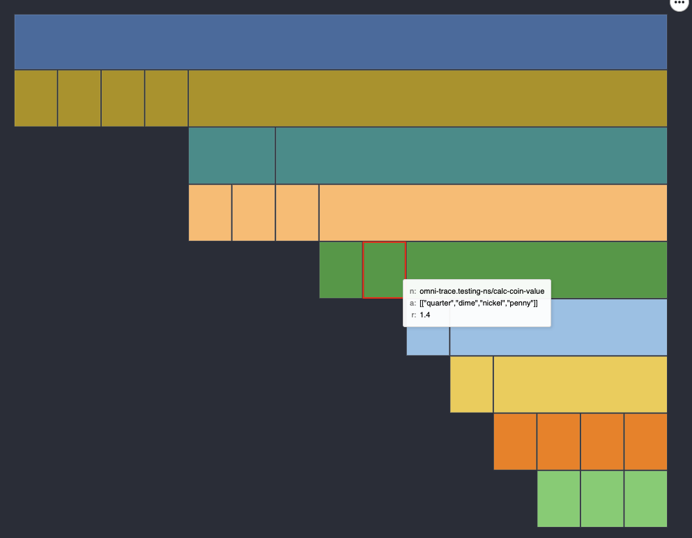

# omni-trace
Omnipotent/omniscient tracing core for debugging clojure(script)

very early alpha, api is still unstable


[](https://clojars.org/org.clojars.cyrik/omni-trace)

or just through github source: 

```clojure

:deps {omni_trace/omni_trace  {:git/url "https://github.com/Cyrik/omni-trace"
                               :sha     "5def7f9ad31d703317e5be5e64a57322e1c89eed"}}
                          
```

## Usage

```clojure
(ns user
  (:require [omni-trace.omni-trace :as o]
            [omni-trace.testing-ns :as e]
            [omni-trace.flamegraph :as flame]
            [portal.web :as p]))


(comment
  ;instrument a namespace
  (o/instrument-ns 'omni-trace.testing-ns)
  ;run functions in that namespace
  (-> e/machine-init
      (e/insert-coin :quarter)
      (e/insert-coin :dime)
      (e/insert-coin :nickel)
      (e/insert-coin :penny)
      (e/press-button :a1))
  ;look at traces for every function that was traced
  @o/workspace
  ;connect to portal
  (def portal (p/open))
  (add-tap #'p/submit)
  ;send the trace to portal as a vegajs flamegraph
  (tap> (flame/flamegraph (flame/flamedata @o/workspace)))
  ;remove tracing from a namesapce
  (o/uninstrument-ns 'omni-trace.testing-ns))
```



## In the works
- better trace output to the REPL
- callbacks from Portal so you can rerun an updated function with the old params by clicking on it in the Flamegraph
- [Debux](https://github.com/philoskim/debux) integration for inner function traces
- trace a function recursivley so you can see the whole graph without without knowing what to trace
- stop tracing functions that get called to often, so that mapping doesn't produce to much data
- (maybe) timetravel in trace
- [Calva](https://github.com/BetterThanTomorrow/calva/) integration to display traces inline

## Related works
- [Debux](https://github.com/philoskim/debux): tracing library that show what is going on inside of a function call. Hopefully this can be integrated as the "inner" function trace in omni-trace
- [Sayid](https://github.com/clojure-emacs/sayid/): clojure only version of what omni-trace is trying to do
- [Postmortem](https://github.com/athos/Postmortem): great library for debugging dataflow
